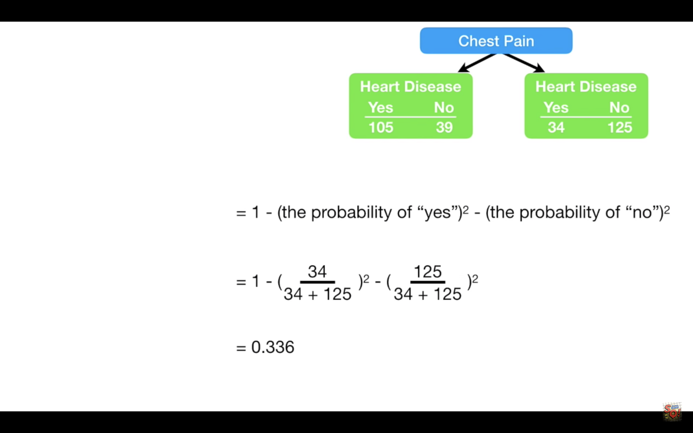
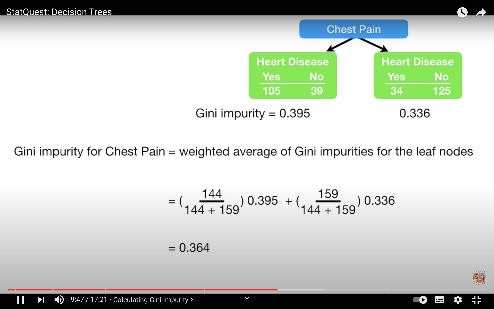

```{r setup, include=FALSE}
knitr::opts_chunk$set(echo = TRUE)
```

## Decision trees

These are notes from the video presentation by StatQuest <https://www.youtube.com/watch?v=7VeUPuFGJHk>

### Categorical features and outcome

To decide what should be the root node, we measure the **impurity** score, called Gini impurity.
Impurity is when a leaf node does not have 100% "yes" or "no".

$$ \text{Gini impurity } = 1 - (probability(yes))^2 - (probability(no))^2 $$



Calculate Gini impurity for each leaf (per feature ), for outcome "yes" and outcome "no". The weighted average impurity will be $$ Gini_{yes} (\frac{number_{yes}}{number_{yes} + number_{no}}) + Gini_{no} (\frac{number_{no}}{number_{yes} + number_{no}})$$
Then choose the feature with the lowest Gini impurity score as a root node.



Calculate the Gini impurity score at each node. If it is lower than the following node than make the node a leaf node. No need to separate further.

### Continuous features

If the feature is numerical, then follow the follwing steps:

1. Sort the numerical variable in ascending order
1. Calculate averages between adjacent observations (rows).
1. Calculate the Gini impurity score for each average value (< vs >=)
1. Pick the average value with the lowest impurity score as the cutoff for the decision tree.

### Ranked data (ordinal variable)

Calculate impurity scores for all the possible ranks, example: ranking is 1 to 4, then calculate impurity scores for $$ \leq  1, \leq 2, \leq 3$$. We don't have to calculate impurity score for <= 4 because this would include all the data.

### Multiple choice data

For multiple choices like **blue**, **green** and **red**, we calculate impurity scores for all combinations: 

1. red
1. green
1. blue
1. red or green
1. red or blue
1. green or blue

Again, we don't calculate an impurity score for blue, green or red because it includes everyone.

## Build a random forest, use it and estimate its accuracy

Decision tress are easy to build, use and interprete. They are however inaccurate for predictive learning. They are not good to classify, to repdict the future.

To create a random forest, follow the following steps:

1. Create a bootstrapped dataset by randomly selecting observations with replacement. <span style="color: red;">Does the boostrapped dataset have the same size as the original dataset?</span>
2. Create a decision tree with the bootstrapped dataset with only a random (without replacement) subset of variables/coilumns at each node.
3. Go back to step 1 and repeat. Do this 100's of times. This results ina variety of trees, with reduced correlation between them.
4. To use the random forest, run an unlabelled observation down each tree, keep track of predicted outcome per tree. Make a decision based on the the majority decision over all the tress.

**B**ootstrapping the data and using the **agg**regate to make a decision is called **bagging**.

Typically 1/3 od the data ends up not being part of the bootstrapped dataset. These are known **as out-of-bag** dataset. To measure the accuracy of the random forest, we can run through the out-of-bag sample through each respective tree built without it. Keep track of how accurately each forest predicts each out-of-bag observation. THe proportion of Out-Of-Bag samples that were incorrectly classified is the **Out-Of-Bag_error**.

We then change the number of variables /columns used per step, generate a new random forest and calculate the Out-Of-Bag-Error and compare to that of the previously built random forest with a different number of columns. Do this a bunch of times then choose the most accurate random forest that gives the best error value. Typically, we start with number of columns equald to the square root of the total number of variables $\sqrt{M}$.


In conclusion:

1. Build a random forest
1. Estimate the accuracy of a random forest
1. Change the number of variables used per step, do this a bunch of times and then choose the most accurate forest.

### Missing data 

### Missing data in original dataset

Start by using the most common value as initial guess for categorical variable, and median value for numeric variable. Now we want to refine these guesses.

We need to determine the subset of observations similar to the observation missing a value in a variable. We do this by generating a proximity matrix.

1. Build a random forest
2. Run all the data down each tree in the forest and find *similar* observations to the guessed "missing value" observation ending up at the same leaf. Ending up at the same leaf node is how similarity is defined for random forests. A proximity matrix is built by accruing the number of times observations end up at the same leaf, after running through each tree in the forest. Each proximity value is then divided by the total number of trees.
3. For the observation missing a value in a variable:
   + **Categorical variable** we calculate the weighted frequency of "yes" and "no" using proximity values at the weights.
    $$ \text{weighted frequency for "yes"} = \text{Frequency yes in known sample x } \frac{\text{Proximity of yes}}{\text{all of Proximities}} $$
    The weighted frequency for **no** is:
    $$ \text{weighted frequency for "no"} = \text{Frequency no in known sample x } \frac{\text{Proximity of no}}{\text{all of Proximities}} $$
 The new guess will be the one with the higher weighted frequency.
   + **Numeric variable** we calculate the weighted average value and use it as a revised guess.
    $$ \Sigma_{i \in known} X_i \frac{\text{Proximity of } X_i}{\text{all of Proximities}} $$
    where $X_i$ is the value of the known variable.
4. Go back to step 1 with the revised guesses. Do this 6 or 7 times until the missing values **converge**.
 
### Missing data in new sample to be categorised

We need to make a guess of a missing variable to be able to run the observation through the tress and make a decision. 
Follow these steps:

1. Create two copies of the data, one with outcome **yes** and one with outcome **no**.
2. Use the proximity matrix iterative process to make a good guess about the missing values, for each of the **yes** and **no** samples.
3. Run the two samples down the trees in the forest, and pick the sample correctly labelled the most often.
   


