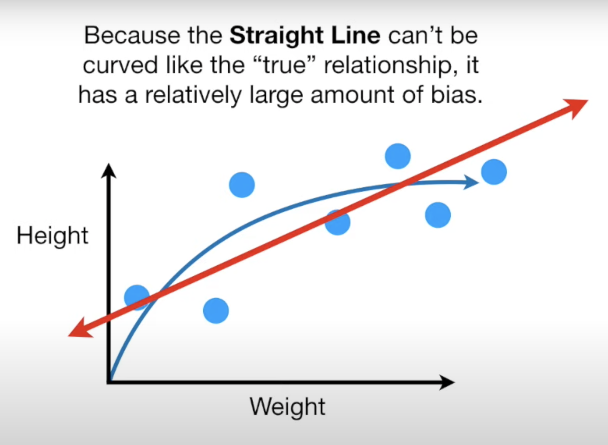
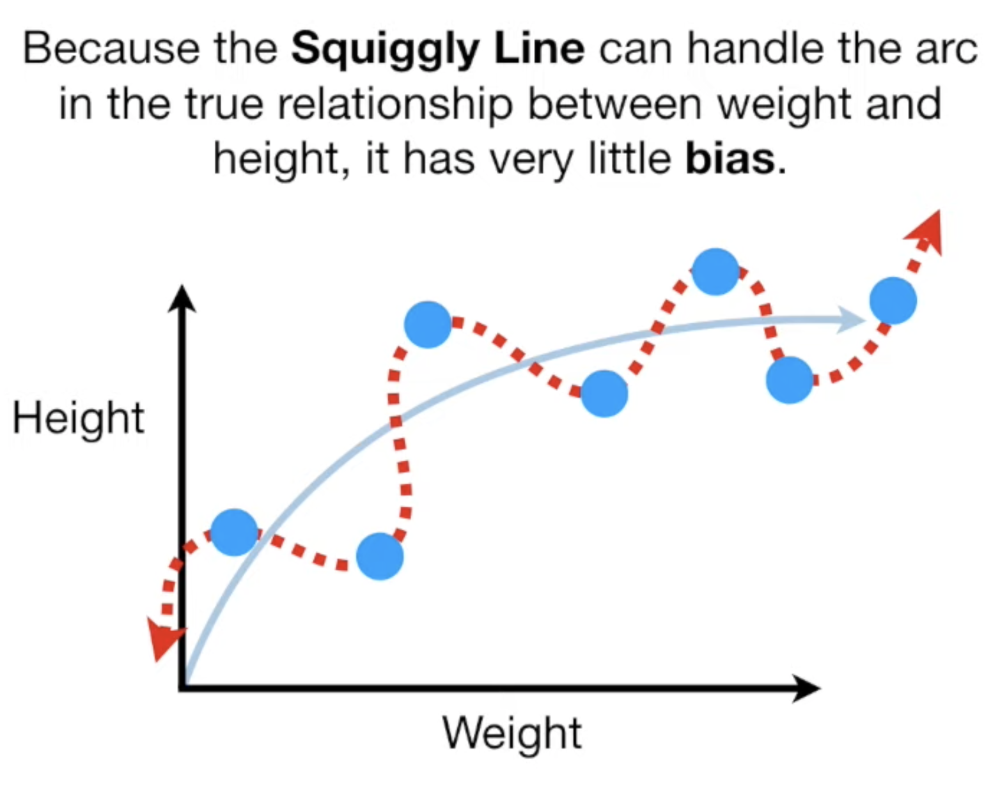
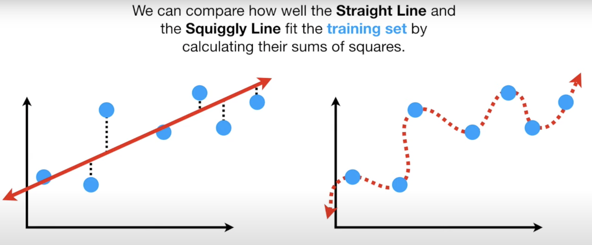
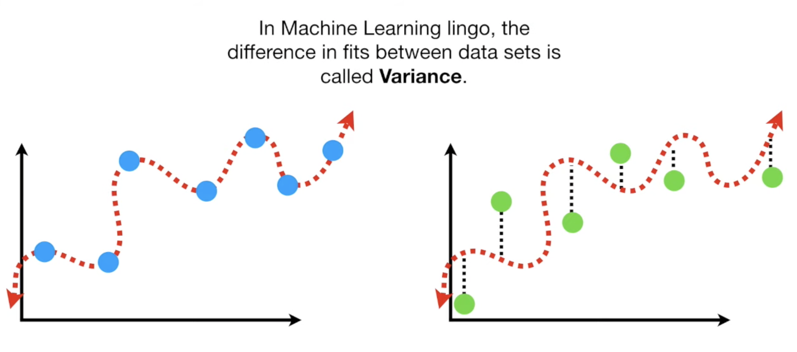

```{r setup, include=FALSE}
knitr::opts_chunk$set(echo = TRUE)
```

These notes are based on the StatQuest video <https://www.youtube.com/watch?v=EuBBz3bI-aA&feature=youtu.be>

## Bias
__Bias__ is the inability for a machine learning method (like linear regression) to capture the true relationship.

In the following example, we would like to predict the height of mice based on their weight. We divide the data set in training (blue) and testing (green) data sets.

### Training set bias

We use two machine learning methods to predict height based on weight: __linear regression__ (least squares) and another method which uses a __squiggly line__.





To assess bias, we calculate the __sum of squares__: measure the distances from the fitted lines to the data, square them and add them up. The squiggly line fits the training data so well, its sum of squares is __0__.

Therefore the squiggly lines wins the bias contest for the training set.



### Testing set bias

Even though the squiggly line made a perfect job predicting height with the training set, it did a terrible job with the testing set. The bias resulting from the straight line is lower than that of the squiggly line in the testing set.

The difference in fits between data sets is called __Variance__.
 


The straight line has a high bias but a low variance, because the sums of squares are very similar for different data sets. The squiggly line is __overfitting__ the training data.

## Regularisation

The ideal machine learning algorithm would have __low bias__ and __low variability__. This is done by finding the sweet spot between a simple model (straight line) and a complex model (squiggly line). There are three commonly used methods for finding the sweet spot:

1. Regularisation
1. Boosting (Gradient and Extreme Gradient Boosting)
1. Bagging (as in Random Forests)

### Ridge regression

__Small sample sizes__ of training data can lead to poor Least Squares estimates, that result in terrible machine learning predictions. The main idea behind __Ridge Regression__ is to find a new line that doesn't fit the training data as well, i.e. introduces a small amount of __bias__ into how the new line is fit to the data, resulting in a significant drop in __variance__.

To fit a regression line $y = b + a \times x$, where $b$ is the intercept with the y-axis and $a$ is the slope of the line, then:

* __Regression__ uses __Least Squares__ and minimises the sum of the squared residuals
* __Ridge regression __ minimises the sum of the squared residuals $+ \lambda \times \text{slope}^2$

Ridge regression results in a line with a smaller slope than that of the regression line, therefore making predictions less sensitive to changes in $x$.

#### Ridge regression penalty

$\lambda$ can be any value between 0 and $\infty$. If $\lambda = 0$, then the Ridge line minimises the sum of the squared residuals, same as regression. Increasing $\lambda$ increases the insensitivity of the prediction to the value of $x$.

To choose $\lambda$, we try a bunch of values and use __10-fold cross-validation__ to determine which value minimises the variance.

When applied to logistic regression, Ridge regression optimises the sum of the liklihoods $+ \lambda \times \text{slope}^2$. In general, the ridge regression penalty has all the regression parameters squared, except for the y-intercept. For example, for a model:
$$y = a_0 + a_1 x_1 + a_2 x_2 + ... a_n x_n$$ 
Ridge regression tries to minimise:
$$\lambda \times \sum_{i =1}^n a_i^2$$

### Lasso Regression

__Lasso regression__ is similar to Ridge regression. Lasso regression aims to introduce a small amount of bias and reduce variance by minimising:
$$\text{the sum of the squared residuals } + \lambda \times \left|\text{the slope}\right|$$

Both Ridge and Lasso regression can be used in similar contexts (categorical and continuous predictors, categorical and continuous outcomes, models combining different types of data).

__Difference__: Ridge regression (L2 norm) reduces the slope asymptotically to 0 as $\lambda \to \infty$ , whereas Lasso regression (L1 norm) can reduce slopes all the way to 0, thus eliminating the influence of the corresponding variable. Ridge tends to perform better when most variables are useful. Lasso performs better when there are many irrelevant variables (feature selection). Fore more information <https://www.youtube.com/watch?v=Xm2C_gTAl8c>.

### Elastic-Net regression

If there are a lot of variables, it is difficult to know whether to use Ridge or Lasso regreression. We can then use __Elastic Net regression__ which combines the strengths of the two regularisation methods by minimising:
$$\text{the sum of the squared residuals } + \lambda_1 \times \sum_{i =1}^n |a_i| + \lambda_2 \times \sum_{i =1}^n a_i^2$$
We use cross-validation to determine the best values of $\lambda_1$ and $\lambda_2$. The Elastic-Net regression is espacially __good at dealing with situations when there are correlations between parameters__. This is because Lasso tends to pick just one of the correlated terms and eliminate the others, while Ridge tends to shrink all of the parameters for the correlated variables together.

### Cross validation

How do we choose a machine learning method? Logistic regression, K-nearest neighbour, support vector machine? __Cross validation__ allows to compare different machine learning methods and get a sense of how well they will work in practice.

In practice, it is common to use ten-fold cross validation, ie divide the dataset into 10 blocks then cross validate with different methods. We can also use 10-fold cross validation to fidn the best value for tuning parameters (such as in Ridge, Lasso and Elastic-Net regression).

## Ridge, LAsso, Elastic-Net  Regression in R

https://www.youtube.com/watch?v=ctmNq7FgbvI
